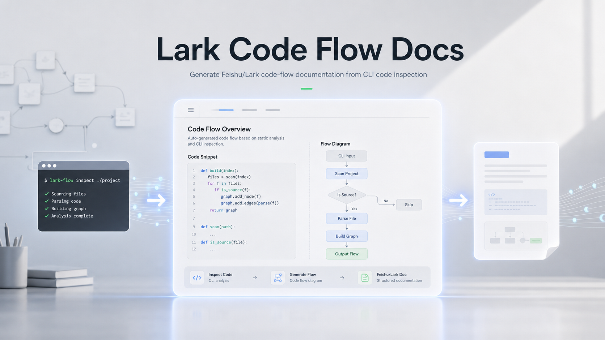

# Lark Code Flow Docs



`lark-code-flow-doc` is a Codex skill for creating Feishu/Lark Docx documents that explain how code runs.

It guides an AI agent to inspect a codebase with CLI tools, trace the runtime flow, create Feishu whiteboard diagrams, and write a flow-first code explanation with precise code evidence.

## What This Skill Focuses On

This skill is not a generic README generator. It is designed for code-flow documentation:

- Start from the real runtime path: startup script, build target, entry function, initialization, callbacks or loops, and outputs.
- Use Feishu whiteboards for execution flow, data flow, call flow, ROS node relationships, or embedded callback/interrupt flow.
- Write Feishu Docx content with concise explanations, evidence paths, tables, and correctly tagged code blocks.
- Add concise comments to key lines inside code blocks, then explain what those lines do in the runtime flow.
- Mark static-analysis conclusions, assumptions, and unverified runtime behavior clearly.

The core rule:

```text
Explain code by flow, not by file order.
```

## Document Shape

A generated Feishu document should usually contain:

1. Reading scope: included paths, excluded vendor/generated/build paths, and inspection method.
2. One-paragraph conclusion: responsibility, system position, input, output, and verification status.
3. Main flow whiteboard: the diagram that explains how the code runs.
4. Entry chain: startup command or script, build declaration, executable target, main function, and first business call.
5. Core code flow: step-by-step code evidence in execution order.
6. Data or state flow: where data comes from, how it changes, and where it goes.
7. Key symbols table: important classes, functions, config files, and their roles.
8. Risks and unverified points: hardware, credentials, models, environment, or branches not confirmed.

## Code Explanation Style

Each important code snippet should answer:

```text
Flow position: where this code sits in the runtime path.
Evidence: file path and symbol.
Code: minimal snippet with correct language tag.
Explanation: what it does and why it moves the flow forward.
Next: where the flow continues.
```

Code blocks should not be raw dumps. Add short comments to the key lines or key groups, then explain those comments in prose below the block.

Example:

````markdown
### Step 2: CMake defines the executable target

Evidence: `src/base_control/CMakeLists.txt`

```cmake
add_executable(base_control_node src/base_control_node.cpp) # Creates the runtime node binary.
ament_target_dependencies(base_control_node rclcpp std_msgs) # Links ROS message/runtime deps.
```

Explanation:

This declares `base_control_node` as the executable target. Later launch or startup commands run this target, so this CMake block connects the build configuration to the runtime entry.

Next:

Trace `src/base_control_node.cpp::main`.
````

## Code Block Tags

Use accurate language tags:

| Content | Tag |
|---|---|
| CMake | `cmake` |
| C++ | `C++` |
| C | `c` |
| Python | `python` |
| Shell scripts and CLI commands | `bash` |
| XML, launch XML, package manifests | `xml` |
| YAML configs | `yaml` |
| JSON configs | `json` |
| Call chains and logs | `text` |

## UTF-8 Write Safety

When writing Feishu Docx content that contains Chinese or other non-ASCII text, prefer a UTF-8 payload file and pass it to `lark-cli` with a relative `@file` path:

```powershell
lark-cli docs +update --api-version v2 --doc "<doc>" --command append --content "@tmp/payload.xml"
```

Avoid piping large here-strings from Windows PowerShell into `--content -`; the pipeline can corrupt UTF-8 text into `?` characters. After writing, fetch an outline or keyword fragment that includes representative non-ASCII text and rewrite via UTF-8 `@file` if corruption appears.

## Install Locally

Install the skill into Codex's local skills directory:

```powershell
git clone https://github.com/xxxylw/feishu-code-flow-doc-skill.git
New-Item -ItemType Directory -Force -Path "$env:USERPROFILE\.codex\skills\lark-code-flow-doc"
Copy-Item -Recurse -Force .\feishu-code-flow-doc-skill\SKILL.md, .\feishu-code-flow-doc-skill\agents, .\feishu-code-flow-doc-skill\references "$env:USERPROFILE\.codex\skills\lark-code-flow-doc\"
```

Restart Codex after installing so the skill is discovered.

## Example Prompts

```text
Use $lark-code-flow-doc to analyze the MCU startup flow and create a Feishu document with a whiteboard diagram.
```

```text
Use $lark-code-flow-doc to explain how this ROS node starts, subscribes, processes data, and publishes output. Write it into a Feishu document.
```

```text
Use $lark-code-flow-doc to document this code path. Focus on the runtime flow, code evidence, and unverified assumptions.
```

## Repository Contents

- `SKILL.md`: skill trigger and main workflow.
- `references/doc-structure.md`: Feishu document structure.
- `references/flow-diagram-rules.md`: whiteboard and diagram rules.
- `references/code-explanation-style.md`: code snippet and explanation style.
- `agents/openai.yaml`: Codex UI metadata.

## Notes

This skill defines the documentation standard. Actual Feishu operations rely on the existing `lark-doc` and `lark-whiteboard` skills plus `lark-cli`.
