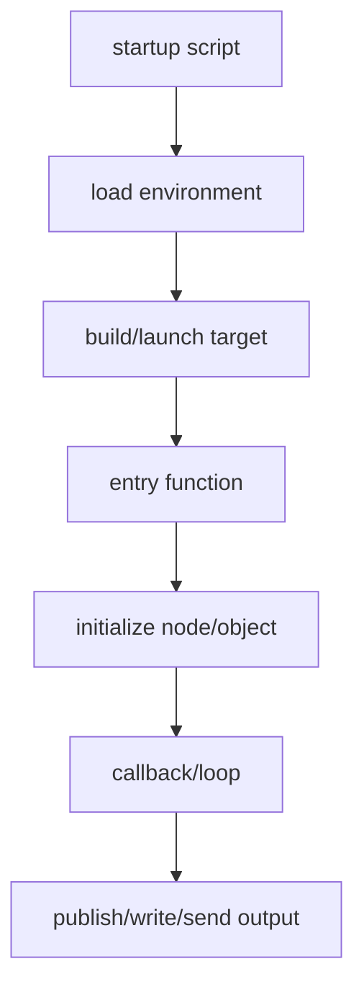
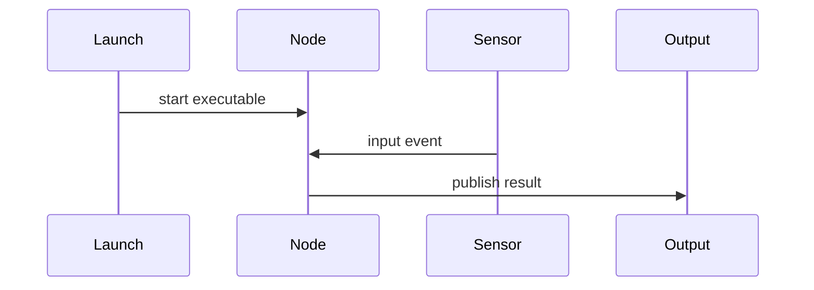

# Flow Diagram And Whiteboard Rules

Use Feishu whiteboards for important structure that is easier to see than read.

## What To Diagram

Prefer diagrams for:

- Main execution flow.
- Data flow.
- Function or class call flow.
- ROS node/topic/service/action relationships.
- Startup, initialization, callback, loop, and output lifecycle.
- Error handling or fallback routes when they affect runtime behavior.

Do not create decorative diagrams. Every diagram must help explain how the code runs.

## Diagram Selection

Use Mermaid when the structure is flow-like or sequence-like:

Use a sequence diagram when time ordering between components matters:

Use a second diagram only when the first diagram becomes too dense.

## Whiteboard Workflow

1. Plan the diagram from code evidence before creating the whiteboard.
2. Keep node labels short: action + symbol/path when useful.
3. Prefer 6-12 nodes for the main diagram.
4. Create or update the Feishu whiteboard through the `lark-whiteboard` workflow.
5. In the Feishu document, place the whiteboard before detailed code snippets.
6. Add a short explanation below the whiteboard that maps diagram nodes to files/functions.

## Diagram Quality Rules

- Start the flow at the real runtime entry, not at an arbitrary file.
- End the flow at observable output: publish, send, write, save, return, command, hardware output, or API response.
- Mark unknown or inferred links explicitly with labels such as `inferred` or `unverified`.
- Keep third-party library internals collapsed into one node unless the user asked to inspect them.
- For ROS, label node/topic/service/action names when visible in code.
- For embedded C/C++, include interrupts, callbacks, timers, and hardware abstraction points when they drive the flow.

## Document Placement

The Feishu document should contain:

- The whiteboard block.
- A one-paragraph explanation of the diagram.
- Optional Mermaid source if useful for review or future edits.
- A table mapping major diagram nodes to code evidence.
