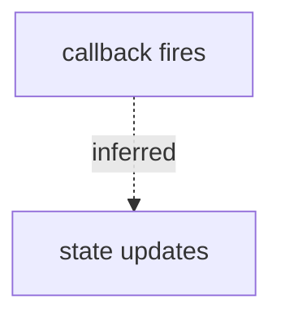

# Whiteboard Strategy

Feishu whiteboards are a core advantage of the platform. Complex flows are far clearer as diagrams than as prose. But not every situation needs one — draw when it helps, skip when it does not.

The whiteboard brick (brick 3 in `doc-bricks.md`) identifies that a flow is present. This file decides whether a whiteboard is actually needed, what type to use, and how to handle failures.

---

## When a Whiteboard Is Required

A whiteboard must be drawn when any of these conditions hold:

- **Multi-step execution flow with branches or rollbacks**: e.g. a startup flow with error-recovery paths
- **Three or more components interacting**: A calls B, B calls C, C writes back to A — prose alone loses the reader
- **Multi-party timing collaboration**: pub/sub across nodes, message sequences between modules, training pipeline stages
- **Data transformation from source to sink**: source → decode → filter → write, with 3+ transformation steps
- **State machine**: 3+ states where transition conditions need to be explicit

---

## When a Whiteboard Is Optional

A whiteboard is recommended but may be replaced by prose + table when:

- Two-party bidirectional interaction (sequence diagram is clearest, but a table works)
- Single-chain linear flow with no branches (A→B→C→D), where a text list is equally clear
- Overview architecture diagram

Judgment method: try describing the section in prose. If one sentence suffices, skip the diagram. If it takes multiple sentences, consider drawing.

---

## When Not to Draw

- Single-step operations or single-point conclusions
- Static classification or static comparison (use a table)
- Configuration item listing (use a table)
- Concept definitions (use prose)
- Trivially simple chains where the diagram adds no information

Do not turn "install conda" into a flowchart.

---

## Diagram Type Selection

| Content | Type | Criterion |
|---------|------|-----------|
| Execution / data / call flow, lifecycle | flowchart TD/LR | Focus on "what happens next" |
| Multi-party timing, message round-trips | sequenceDiagram | Focus on "who sends what to whom, in time order" |
| Module composition, component layering | flowchart (architecture) | Static structural relationships, not dynamic |
| Data form transformation in pipeline | flowchart (data flow) | Nodes are "data forms", edges labeled with transformations |
| Finite state machine, lifecycle states | stateDiagram-v2 | Nodes are "states", edges labeled with "trigger conditions" |

Selection rules:
- Default: flowchart TD (top-down), most general
- "Who does what before whom" with multiple parties → sequence diagram
- Nodes are "a system state" rather than "an action" → state diagram
- Nodes are "data forms" (raw bytes / decoded frame) → flowchart, node labels describe data forms

---

## Node Label Conventions

- Labels are short: action + symbol/path
- No line breaks, HTML, or long paths inside labels
- Common cause of Mermaid parse failures: `<br/>`, special symbols, or overly long path names in labels
- Move long paths to the mapping table below the diagram

---

## Whiteboard and Table Collaboration

A whiteboard expresses "shape", a table expresses "detail". Each whiteboard should be followed by a mapping table:

| Diagram node | Corresponding code/file/command | Note |
|--------------|--------------------------------|------|
| ASR node | src/asr_node.cpp::AsrNode | Receives microphone input |
| LLM node | src/llm_node.cpp::onRequest | Handles /llm_request |

The two are complementary, not interchangeable.

---

## Diagram Quality Rules

- Start point must be a real runtime entry (startup command, entry function, external trigger), not an arbitrary file
- End point must be an observable output (publish, write, return, API response, saved file)
- Inferred or uncertain links must be labeled. In Mermaid, use dashed lines with labels:



- Collapse third-party library internals into a single node unless the user asks to inspect them
- For ROS / embedded / training pipelines: label visible runtime identifiers (node/topic/service/action/interrupt/callback)

---

## When to Split Diagrams

Split into a main diagram plus detail diagrams when:
- A single diagram gets too dense to read
- Two distinct main flows exist (e.g. both an execution flow and a separate data flow)
- The diagram would need to span too many abstraction levels at once

Each split diagram should have its own mapping table.

---

## Fallback Path

When Mermaid fails to parse, follow this sequence:

1. **First attempt**: create with original labels
2. **Failure → second attempt**: remove HTML tags, remove special symbols, shorten labels (aim for short labels), retry once
3. **Still fails → degrade**: use a table + prose description. Record "whiteboard creation failed, replaced with table" in the Risks & Unverified brick.

Do not retry indefinitely. Two failures → degrade.

---

## Creating Whiteboards in Feishu

### Diagram type routing

| Diagram type | Recommended path | Why |
|-------------|-----------------|-----|
| Flowchart (no color needed) | `mermaid` inline | Fastest, one step, readable |
| Flowchart (color needed) | `svg` inline | Full color control with One Dark palette |
| Architecture diagram | `svg` inline | Precise layout + custom colors |
| Sequence / state / class / pie | `mermaid` inline | Mermaid handles these well, no color needed |
| Mind map | `mermaid` inline | Mermaid handles these well |
| Bar/line/funnel/pyramid | `svg` inline | Mermaid cannot express these shapes |

### Whiteboard type reference

| type | How to write | Color control | Steps | Use when |
|------|-------------|---------------|-------|----------|
| `mermaid` | Inline mermaid syntax in document XML | ❌ Feishu ignores classDef/linkStyle | 1 (inline) | Simple diagrams that do not need custom colors |
| `svg` | Inline complete self-contained SVG in document XML | ✅ Full control over all colors/styles/layout | 1 (inline) | **Default for colored diagrams** — moderate to high complexity |
| `plantuml` | Inline PlantUML in document XML | ⚠️ Partial (skinparam), but Feishu parse often fails | 1 (inline) | Not recommended — high parse-failure rate on Feishu |
| `blank` | Insert empty whiteboard, then write via lark-whiteboard skill | ✅ Via raw node JSON | 2 (insert + API write) | Only when editable Feishu-native nodes are required |

**Color control reality check** (tested 2026-06-22): Feishu's mermaid renderer silently strips all custom styling (`classDef`, `linkStyle`, `fill`, `stroke`). If color matters, use `svg`. PlantUML inline content triggers `degrade_code=2107` (parse failure) and renders as an empty whiteboard on current Feishu.

---

## SVG Color Scheme (One Dark)

All SVG whiteboards use a single fixed palette derived from the One Dark color scheme. This ensures visual consistency across all diagrams and avoids ad-hoc color choices.

### Semantic roles

| Role | Fill | Border | Use for |
|------|------|--------|---------|
| I/O node | `#212337` | `#61afef` | Data input/output: load dataset, save model, publish, write file |
| Process node | `#1a2e29` | `#98c379` | Computation: train, preprocess, transform, build |
| Check node | `#2e2918` | `#e5c07b` | Evaluation/decision: eval, validate, gate, branch |
| Highlight node | `#2a1f24` | `#e06c75` | Emphasis: error path, critical warning, the node the reader must not miss |
| External node | `#1e2233` | `#56b6c2` | Third-party/external: API call, external service, pre-trained model |
| Arrows / connectors | — | `#56b6c2` | All directed edges |
| Text | — | `#abb2bf` | All node labels and edge labels |

### SVG template

Every SVG whiteboard must follow this structure:

```xml
<whiteboard type="svg">
<svg xmlns="http://www.w3.org/2000/svg" viewBox="0 0 WIDTH HEIGHT">
  <defs>
    <marker id="arr" markerWidth="8" markerHeight="8" refX="7" refY="3" orient="auto">
      <path d="M0,0 L0,6 L7,3 z" fill="#56b6c2"/>
    </marker>
  </defs>
  <!-- I/O node -->
  <rect x="10" y="13" width="120" height="44" rx="6" fill="#212337" stroke="#61afef" stroke-width="2"/>
  <text x="70" y="40" text-anchor="middle" fill="#abb2bf" font-size="13" font-family="sans-serif">load data</text>
  <line x1="130" y1="35" x2="166" y2="35" stroke="#56b6c2" stroke-width="2" marker-end="url(#arr)"/>
  <!-- Process node -->
  <rect x="170" y="13" width="120" height="44" rx="6" fill="#1a2e29" stroke="#98c379" stroke-width="2"/>
  <text x="230" y="40" text-anchor="middle" fill="#abb2bf" font-size="13" font-family="sans-serif">train</text>
</svg>
</whiteboard>
```

### SVG construction rules

- Fully self-contained: inline all `defs`, `marker`, `gradient` — no external references
- Define `viewBox` so the diagram scales correctly in Feishu
- Use standard SVG elements only (`rect`, `text`, `line`, `path`, `circle`, `polygon`, `ellipse`)
- Rounded rectangles (`rx="6"`) for all nodes — consistent shape language
- Arrow markers: define once in `<defs>`, reference via `marker-end="url(#arr)"`
- Node width/height should accommodate the longest label in the diagram
- Text: `text-anchor="middle"` centered, `dominant-baseline` not required if y-coordinate is set to visual center
- Do not invent colors outside the palette above. If a new semantic role is needed, add it here with a name + fill + border pair, do not use ad-hoc hex values in diagrams.
