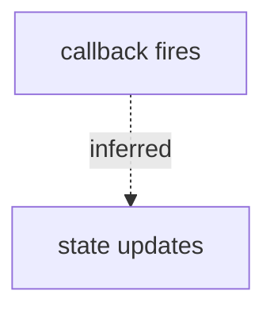

# Whiteboard Strategy

Feishu whiteboards are a core advantage of the platform. Complex flows are far clearer as diagrams than as prose. But not every situation needs one — draw when it helps, skip when it does not.

The whiteboard brick (brick 3 in `doc-bricks.md`) identifies that a flow is present. This file decides whether a whiteboard is actually needed, what type to use, and how to handle failures.

---

## When a Whiteboard Is Required

A whiteboard must be drawn when any of these conditions hold:

- **Multi-step execution flow with branches or rollbacks**: e.g. a startup flow with error-recovery paths
- **Three or more components interacting**: A calls B, B calls C, C writes back to A — prose alone loses the reader
- **Multi-party timing collaboration**: pub/sub across nodes, message sequences between modules, training pipeline stages
- **Data transformation from source to sink**: source → decode → filter → write, with 3+ transformation steps
- **State machine**: 3+ states where transition conditions need to be explicit

---

## When a Whiteboard Is Optional

A whiteboard is recommended but may be replaced by prose + table when:

- Two-party bidirectional interaction (sequence diagram is clearest, but a table works)
- Single-chain linear flow with no branches (A→B→C→D), where a text list is equally clear
- Overview architecture diagram

Judgment method: try describing the section in prose. If one sentence suffices, skip the diagram. If it takes multiple sentences, consider drawing.

---

## When Not to Draw

- Single-step operations or single-point conclusions
- Static classification or static comparison (use a table)
- Configuration item listing (use a table)
- Concept definitions (use prose)
- Trivially simple chains where the diagram adds no information

Do not turn "install conda" into a flowchart.

---

## Diagram Type Selection

| Content | Type | Criterion |
|---------|------|-----------|
| Execution / data / call flow, lifecycle | flowchart TD/LR | Focus on "what happens next" |
| Multi-party timing, message round-trips | sequenceDiagram | Focus on "who sends what to whom, in time order" |
| Module composition, component layering | flowchart (architecture) | Static structural relationships, not dynamic |
| Data form transformation in pipeline | flowchart (data flow) | Nodes are "data forms", edges labeled with transformations |
| Finite state machine, lifecycle states | stateDiagram-v2 | Nodes are "states", edges labeled with "trigger conditions" |

Selection rules:
- Default: flowchart TD (top-down), most general
- "Who does what before whom" with multiple parties → sequence diagram
- Nodes are "a system state" rather than "an action" → state diagram
- Nodes are "data forms" (raw bytes / decoded frame) → flowchart, node labels describe data forms

---

## Node Label Conventions

- Labels are short: action + symbol/path
- No line breaks, HTML, or long paths inside labels
- Common cause of Mermaid parse failures: `<br/>`, special symbols, or overly long path names in labels
- Move long paths to the mapping table below the diagram

---

## Whiteboard and Table Collaboration

A whiteboard expresses "shape", a table expresses "detail". Each whiteboard should be followed by a mapping table:

| Diagram node | Corresponding code/file/command | Note |
|--------------|--------------------------------|------|
| ASR node | src/asr_node.cpp::AsrNode | Receives microphone input |
| LLM node | src/llm_node.cpp::onRequest | Handles /llm_request |

The two are complementary, not interchangeable.

---

## Diagram Quality Rules

- Start point must be a real runtime entry (startup command, entry function, external trigger), not an arbitrary file
- End point must be an observable output (publish, write, return, API response, saved file)
- Inferred or uncertain links must be labeled. In Mermaid, use dashed lines with labels:



- Collapse third-party library internals into a single node unless the user asks to inspect them
- For ROS / embedded / training pipelines: label visible runtime identifiers (node/topic/service/action/interrupt/callback)

---

## When to Split Diagrams

Split into a main diagram plus detail diagrams when:
- A single diagram gets too dense to read
- Two distinct main flows exist (e.g. both an execution flow and a separate data flow)
- The diagram would need to span too many abstraction levels at once

Each split diagram should have its own mapping table.

---

## Fallback Path

When Mermaid fails to parse, follow this sequence:

1. **First attempt**: create with original labels
2. **Failure → second attempt**: remove HTML tags, remove special symbols, shorten labels (aim for short labels), retry once
3. **Still fails → degrade**: use a table + prose description. Record "whiteboard creation failed, replaced with table" in the Risks & Unverified brick.

Do not retry indefinitely. Two failures → degrade.

---

## Creating Whiteboards in Feishu

**Simple diagrams** (flowchart, sequence, state — can be expressed in a single Mermaid block): embed directly:

```xml
<whiteboard type="mermaid">
flowchart TD
  A["startup script"] --> B["load config"]
  B --> C["entry function"]
  C --> D["output result"]
</whiteboard>
```

**Complex diagrams** (require precise node/edge placement, multi-region layouts, custom icons — beyond what a single Mermaid block can express):
1. Insert `<whiteboard type="blank"></whiteboard>` to create an empty whiteboard
2. Call the `lark-whiteboard` skill to write content into it

After creation, place the whiteboard block in the document body + a one-paragraph read guide + a mapping table.
